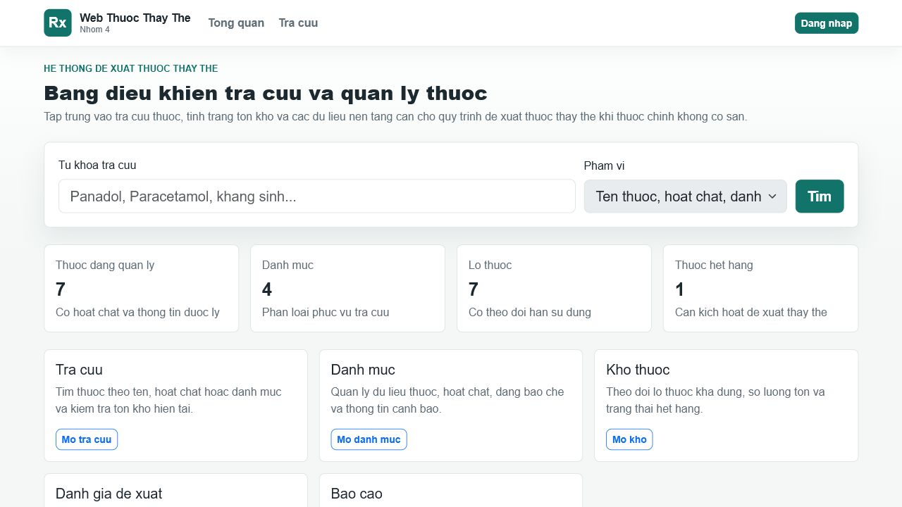
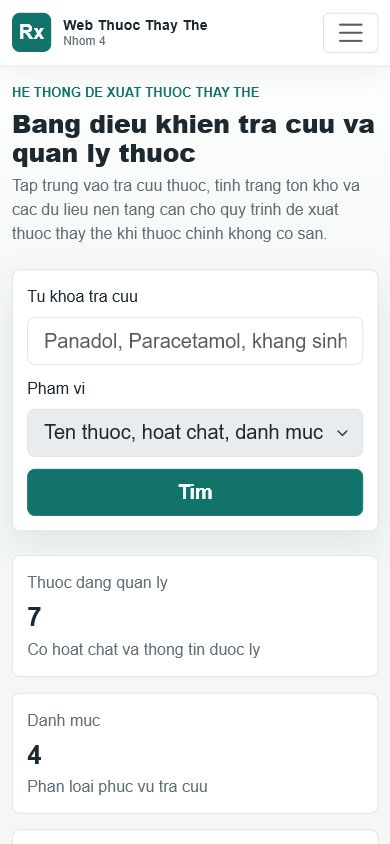

# Current UI audit - 2026-06-22

Public baseline: <https://nnhom4web.somee.com>

This audit is the evidence input for Jira `N4WTT-207`. It does not authorize implementation.
Frontend work remains blocked until the Figma design gate is approved.

## Baseline captures

### Home - desktop 1280 x 720

### Home - mobile 390 x 844

### Drug detail - mobile 390 x 844

## Measured baseline

| Signal | Result |
| --- | --- |
| Desktop viewport | 1280 x 720 |
| Mobile viewport | 390 x 844 |
| Horizontal overflow | None at either viewport |
| Mobile H1 | 24.8 px |
| Root document language | `en` instead of `vi` |
| Razor views | 20 |
| Source files scanned for UI/domain copy | 66 |
| Files containing likely unaccented Vietnamese | 25 |
| Candidate occurrences | 216 |
| Unique candidate strings | 161 |

The string inventory includes Razor copy, validation/domain messages, seed data, reporting labels and
AI fallback/prompt text. Tests also assert current unaccented strings, so localization affects test
fixtures and acceptance assertions, not only views.

## What already works

- Public search and detail flows are understandable without training.
- Responsive grids collapse without horizontal overflow at 390 px.
- The page has a skip link and visible focus styling.
- Status colors distinguish success, warning, danger and information.
- Recommendation score, safety warnings and AI disclosure remain separate.
- Navigation and role-based actions are server-rendered and keyboard reachable.

## Findings

### P0 - Language integrity and trust

- All visible Vietnamese is written without diacritics, which reduces readability and perceived
  reliability for a medicine-related product.
- `<html lang="en">` gives assistive technology the wrong pronunciation rules.
- The mobile menu accessible name is `Toggle navigation`, while the rest of the interface is
  Vietnamese.
- Mixed product language remains in user-facing copy: `score`, `rule-based`, `backup metadata`,
  `admin` and `AI generated`.
- Date, number and currency formatting are not governed by a single `vi-VN` culture policy.

### P1 - Information hierarchy

- The primary job is finding an available substitute, but the first viewport gives equal visual
  weight to four metrics and five workflow cards.
- Public users see management entry points they cannot open, then get redirected to login. The home
  page should adapt by role or emphasize public tasks first.
- The disabled `Phạm vi` select looks interactive. It should either work or be removed.
- Five repeated workflow cards make the home page read like a component catalogue instead of an
  operational dashboard.

### P1 - Drug detail and AI interaction

- On mobile, the pharmaceutical information card consumes most of the first screen; availability and
  alternatives appear too late for an out-of-stock decision.
- Every recommendation repeats a long reason list and the same AI action. The hierarchy between score,
  stock, safety warning and optional explanation needs stronger grouping.
- The back action uses a text character (`< Quay lai`) instead of a familiar icon with a clear label.
- AI copy should state that it explains an existing ranking and cannot prescribe or override safety
  warnings.

### P1 - Accessibility and responsive behavior

- The mobile navigation toggle is reachable, but its accessible name is not localized.
- Component states are incomplete as a design contract: loading, retry, offline, empty, permission
  denied and AI rate-limit states are implemented inconsistently.
- Dense tables rely on horizontal scrolling. Figma must define mobile table behavior rather than leave
  it to Bootstrap defaults.
- Touch targets, 200% zoom, contrast and long Vietnamese-word wrapping need explicit acceptance tests.

### P2 - Visual system

- Arial renders Vietnamese but makes the product look generic and dated.
- Teal is used for brand, navigation, CTA and many status surfaces, reducing semantic distinction.
- Icons are almost absent, so repeated text carries navigation and action recognition alone.
- Shadows and cards are applied broadly. Sections, metrics and recommendations need clearer hierarchy
  without nesting cards inside cards.

## Redesign priorities

1. Correct language, terminology, culture and accessible names.
2. Reframe the home page around search, availability and role-specific next actions.
3. Bring stock and substitute decisions earlier on drug detail mobile.
4. Define semantic components and all interactive states in Figma.
5. Prototype desktop/mobile user flows before implementation.
6. Validate the implementation against locked Figma frames and the Vietnamese glossary.

## Non-goals

- Do not change deterministic recommendation scoring in the UI sprint.
- Do not allow AI to change stock, score, warning or expert decisions.
- Do not replace server-side RBAC with client-only visibility.
- Do not add decorative gradients, nested cards or marketing-style hero content.
